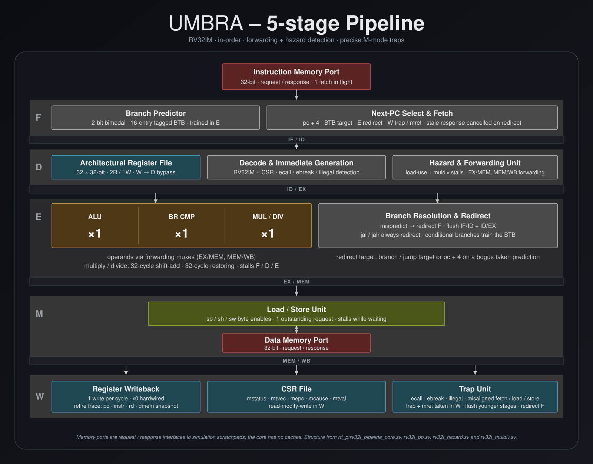
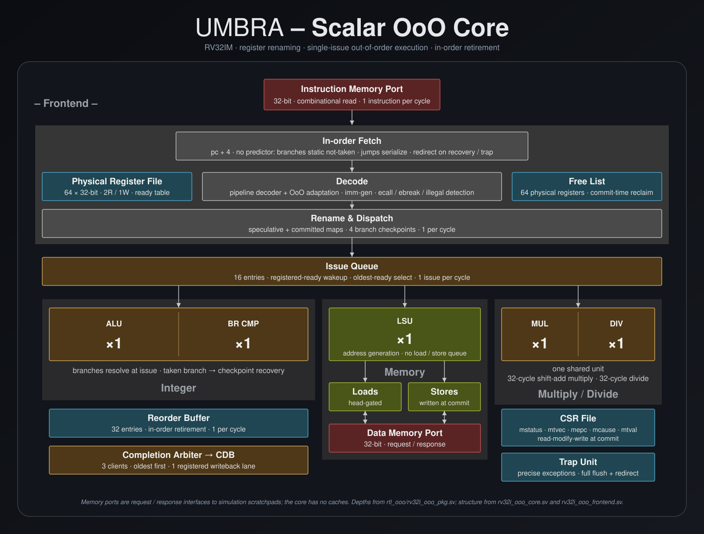
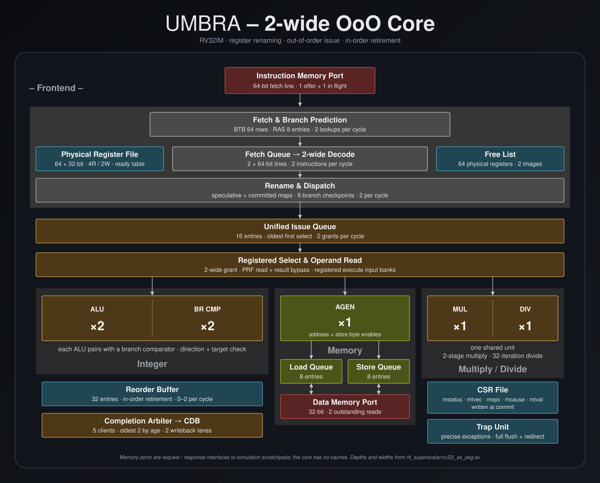
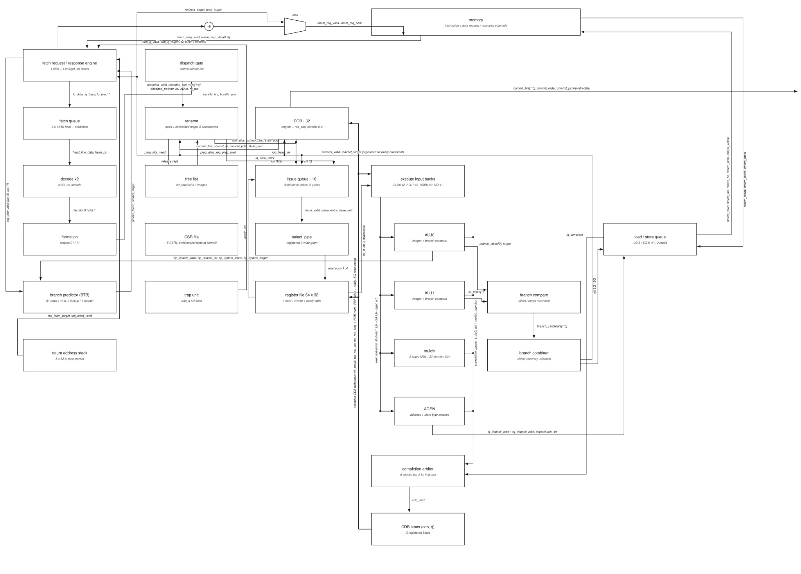

<!--
SPDX-FileCopyrightText: Copyright 2026 He Ning
SPDX-License-Identifier: Apache-2.0
-->

<p align="center">
  <picture>
    <source media="(prefers-reduced-motion: reduce)" srcset="portfolio/assets/umbra_cover_v2.svg"/>
    
  </picture>
</p>

<p align="center">
  <a href="rtl_superscalar/">RTL</a> ·
  <a href="tb/">Testbenches</a> ·
  <a href="docs/IMPLEMENTATION.md">Implementation</a> ·
  <a href="#benchmarks">Benchmarks</a> ·
  <a href="https://github.com/HeNing45/UMBRA/releases/tag/physical-osu45-20ns-frontend">GDS release</a>
</p>

<p align="center">
  <a href="LICENSE"></a>
  <br/>
  Mixed-license repository: original code is Apache-2.0; benchmarks retain their own terms.
  <a href="THIRD_PARTY_NOTICES.md">Third-party licences and notices</a>
</p>

## UMBRA: a 2-wide out-of-order RISC-V processor

UMBRA is an RV32IM processor written in SystemVerilog, with register renaming,
out-of-order execution and 2-wide, in-order retirement. The repository
includes the RTL, superscalar testbenches, bare-metal benchmarks and physical
layout, alongside the earlier single-cycle, pipelined and scalar out-of-order cores.

Implementation results include **100 MHz routed FPGA core timing** and a
**50 MHz ASIC layout**, checked by both Calibre and IC Validator.
The FPGA result is out-of-context timing on a KU5P, not a board-level result;
the ASIC is an academic FreePDK45 / OSU gscl45nm implementation, not fabricated
silicon.

### The four cores

Each generation is kept here so the design can be followed from the simplest
datapath to the superscalar implementation.

| Design | What it adds | Source |
| --- | --- | --- |
| Single-cycle RV32I | The starting point: fetch, decode and execute in one cycle | [rtl/](rtl/) |
| Five-stage RV32IM pipeline | Overlapping instructions, forwarding, hazards and branch redirects | [rtl_p/](rtl_p/) |
| Scalar out-of-order | Register renaming, dynamic scheduling and ordered retirement | [rtl_ooo/](rtl_ooo/) |
| 2-wide out-of-order | Dual issue and retirement, two ALUs and a load/store queue | [rtl_superscalar/](rtl_superscalar/) |

<details>
<summary>Five-stage pipeline: microarchitecture</summary>

[](portfolio/assets/umbra_pipeline_overview.svg)

[Pipeline RTL](rtl_p/) · [Open full-size diagram](portfolio/assets/umbra_pipeline_overview.svg)

</details>

<details>
<summary>Single-issue out-of-order core: microarchitecture</summary>

[](portfolio/assets/umbra_scalar_ooo_overview.svg)

[Scalar OoO RTL](rtl_ooo/) · [Open full-size diagram](portfolio/assets/umbra_scalar_ooo_overview.svg)

</details>

## Inside the superscalar core

The core has a 32-entry reorder buffer, 64 physical registers, a unified
16-entry issue queue and 8 branch checkpoints. Two ALUs, a multiply/divide
unit and a dedicated address generation unit feed two writeback lanes.
8-entry load and store queues manage memory operations, while retirement
stays in program order. Registered selection and operand boundaries separate
scheduling from execution.

[](portfolio/assets/umbra_core_overview.svg)

[Open full-size overview](portfolio/assets/umbra_core_overview.svg)

[Frontend](rtl_superscalar/rv32i_ss_frontend.sv) ·
[Rename](rtl_superscalar/rv32i_ss_rename.sv) ·
[Issue queue](rtl_superscalar/rv32i_ss_iq.sv) ·
[Register file](rtl_superscalar/rv32i_ss_prf.sv) ·
[Reorder buffer](rtl_superscalar/rv32i_ss_rob.sv) ·
[Load/store queue](rtl_superscalar/rv32i_ss_lsq.sv) ·
[Core integration](rtl_superscalar/rv32i_ss_core.sv)

<details open>
<summary>Detailed superscalar schematic: signals and connections</summary>



[Open the full-size schematic](portfolio/assets/umbra_architecture.svg)

</details>

### Instruction set

**RV32IM, with CSR instructions and partial machine-mode support.** The `M`
multiply/divide extension is separate from machine privilege mode.

| Area | Implemented support |
| --- | --- |
| Integer | Arithmetic, logic, shifts and comparisons; upper immediates; branches and jumps; byte, halfword and word loads/stores |
| Multiply/divide | `MUL`, `MULH`, `MULHSU`, `MULHU`, `DIV`, `DIVU`, `REM`, `REMU` |
| CSR instructions | Read/write, set and clear operations, including immediate forms |
| Machine state | `mstatus`, `mtvec`, `mepc`, `mcause`, `mtval`, direct-mode trap entry and `MRET` |
| Precise exceptions | `ECALL`, `EBREAK`, illegal instructions and misaligned instruction targets or data accesses |

There are no interrupts, supervisor/user modes, MMU, PMP, compressed, atomic
or floating-point extensions. Unsupported CSRs read as zero and ignore writes.
`FENCE` and `FENCE.I` decode as no-ops; synchronization and full privileged
architecture conformance are outside the implemented scope.

[Decoder](rtl_p/rv32i_pipe_decode.sv) ·
[Multiply/divide unit](rtl_superscalar/rv32i_ss_muldiv.sv) ·
[CSR storage](rtl_superscalar/rv32i_ss_csr_file.sv)

## Implementation results

| | FPGA core | ASIC layout |
| --- | --- | --- |
| Target | Kintex UltraScale+ KU5P | FreePDK45 / OSU gscl45nm |
| Clock | **100 MHz / 10 ns** | **50 MHz / 20 ns** |
| Setup slack | **+0.474 ns** | **+3.181066 ns** |
| Hold slack | **+0.009 ns** | **+0.000109 ns** |
| Measurement | Vivado out-of-context routing | StarRC extraction + PrimeTime |

The FPGA timing covers the CPU block only. External memory, full clock network
integration and software execution on a board are not included.

The ASIC flow includes synthesis, placement, clock tree synthesis, routing,
formal equivalence and extracted timing. The new layout has zero failing
setup/hold endpoints, zero routing DRCs and zero open nets. Calibre and
IC Validator each reported **zero findings across 167 DRC checks**, with
**LVS CORRECT** and **LVS PASS**, respectively, on the same GDS.

The released GDS includes the frontend correction and matches the ASIC results above.

**[Download the GDS](https://github.com/HeNing45/UMBRA/releases/download/physical-osu45-20ns-frontend/umbra_syn_island.gds)**
· [KLayout layer file](physical/umbra_syn_island.lyp)
· [Release and notices](https://github.com/HeNing45/UMBRA/releases/tag/physical-osu45-20ns-frontend)
· [Implementation notes](docs/IMPLEMENTATION.md)

## Verification

The repository includes 67 superscalar testbench sources, shared memory and
trace helpers, Spike comparison support, and CoreMark® and Embench ports.
CoreMark is a trademark of EEMBC.

| Check | Result |
| --- | --- |
| [Spike comparison](verification/run_ss_spike_regression.sh) | 16-instruction ALU smoke plus 36,864 seeded RV32IM commits and accepted store effects matched |
| [Directed testbenches](tb/) | Rerun on `03a2e5c`: 62 of 63 passed; the RAS benchmark retains a cycle-count mismatch, 403 observed versus 374 expected |
| [CoreMark-derived CRC check](sw/coremark/README.md) | Performance and validation seeds passed the expected CRC checks |
| [Embench-IoT](sw/embench/) | All 19 programs completed with successful return values |

## Benchmarks

Rerun on the corrected RTL with GCC 15.2.0 and the same delayed-memory
configuration for both compiler profiles.

| Benchmark | `-O2` | `max` |
| --- | ---: | ---: |
| CoreMark-derived CRC/cycle check (iterations per million timed RTL cycles) | 2.7743 | **3.2029** |
| Embench-IoT (geometric mean relative speed per MHz, 19 programs) | 1.217 | **1.488** |
| Embench combined timed sections (projected at 100 MHz) | 652.8 ms | **560.7 ms** |

`max` uses `-O3`, full loop unrolling, an inline limit of 1000, and 8-byte
function, jump and loop alignment. Both runs use one-cycle instruction/data
responses, pipelined instruction fetch and two outstanding data reads.

These are **RTL simulation results, not on-board measurements**. The 100 MHz
projection assumes the same memory behavior. The CoreMark-derived check
passed its CRCs over 16 iterations. It is shorter than the required ten
seconds and is **not an official CoreMark score**; the values above are
RTL-cycle measurements only. All 19 Embench programs returned success; XGBoost's upstream
self-check is weak at the default scale factor.

```sh
make coremark MEMORY=delayed PROFILE=max MODE=performance ITERATIONS=16
make coremark MEMORY=delayed PROFILE=max MODE=validation ITERATIONS=1
make embench MEMORY=delayed PROFILE=max BENCH=all
```

Use `PROFILE=o2` to reproduce the comparison column.

[Build and run checks](docs/IMPLEMENTATION.md#running-checks) ·
[Software and benchmark ports](sw/README.md) ·
[Simulation runner](verification/run.py) · [Makefile](Makefile)

<details>
<summary>Physical implementation limits</summary>

This is an academic implementation, not foundry signoff. The sub-picosecond
ASIC hold margin is not a robustness margin. Changed intracell metal was not
recharacterized, and 101,843 zero-limit capacitance entries remain unresolved
in the model. Some timing-check classes are untested; multi-corner analysis,
IR drop, electromigration, packaging and silicon qualification are not covered.

Both LVS tools retain a source-intended VSS alias diagnostic. Agreement on this
layout does not establish universal rule-deck equivalence. Proprietary tool
reports and rule decks are not included in this repository.

</details>

## License

This repository contains material under several licences. Original UMBRA RTL,
testbenches, verification tools and documentation are Copyright 2026 He Ning,
licensed under [Apache-2.0](LICENSE); see [NOTICE](NOTICE).

Embench's upstream sources and UMBRA port are GPL-3.0-or-later, with additional
per-file notices. CoreMark software is Apache-2.0 and use of its mark is subject
to the COREMARK® Acceptable Use Agreement. The GDS includes Apache-2.0
OSU/FreePDK45 cell geometry. See [third-party notices](THIRD_PARTY_NOTICES.md)
for component terms and redistribution requirements.
